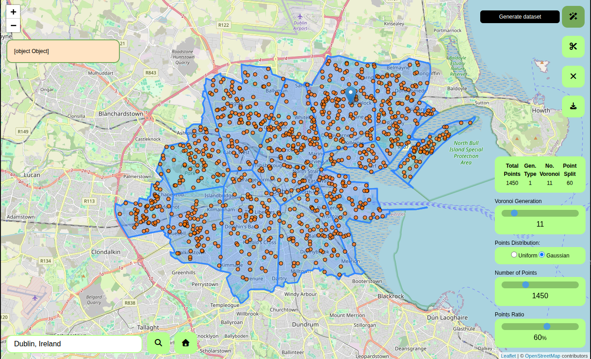

# Radian-Web

RADIAN [https://doi.org/10.1080/15230406.2024.2377981] is a Python-based tool for generating synthetic spatial datasets.

RADIAN-Web [paper awaiting review] is a web-based tool which implements (and improves!) all the existing functionalities of RADIAN, as well as enhancing it's usability and efficiency. 

## What does RADIAN-Web do?
RADIAN web expands upon the functionality of the original RADIAN by packaging it in a web-based format. The JavaScript/Leaflet UI allows for a much clearer picture of the generation process and resulting outputs. It addition it eschews the command line running of RADIAN with an intuitive UI which allows for quick generation (and regeneration) of the desired dataset.

### How to use RADIAN-Web?
* The search bar is used to specify a location whithin which we wish to generate a dataset, the more specific the better (e.g. "Dublin, Ireland", "Paris, France").
* The generation parameters can be adjusted using the relevant radio buttons and sliders -  with the current permutation visible via the readout window.
* Randomly generated metadata columns can be added using the attribute tool, variables include strings, integers, timestamps, and regular expressions
* Datasets can be downloaded at the click of a button.

### How does RADIAN-Web differ from ordinary RADIAN?
The obvious difference is of course that RADIAN-web operates within the users browser, without any need to install any software or dependencies on a local machine. 
Given one of the primary use cases for RADIAN being in educational and classroom settings, RADIAN-web provides a great leap in usability of the software as now it can be distributed to students (or educators) simply by visiting the link via a browser.
